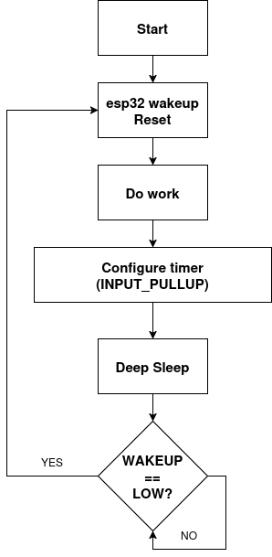
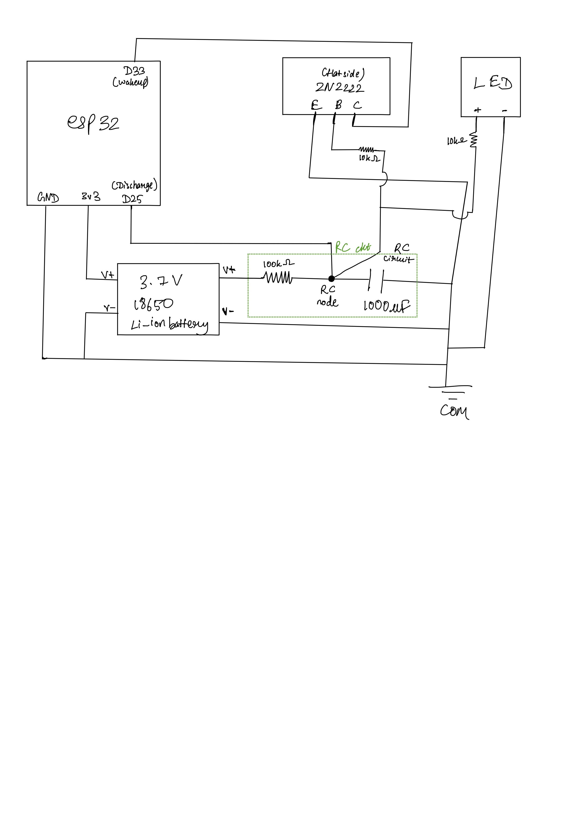

# ESP32 Sleep Systems: From Timer to Hardware Watchdog

## 1. Overview

This project explores different approaches to implementing periodic wake-up behavior on the ESP32, progressing from software-based methods to a fully hardware-driven solution. It is particularly useful for monitoring systems that do not need to run continuously, but instead wake up at roughly defined intervals to perform tasks and then return to sleep, significantly reducing power consumption and improving overall efficiency. An LED is also incorporated into the design as a visual indicator, helping detect and verify the wake-up events and system behavior.

The project is structured in three stages:

- Stage 1 — Timer-based Light Sleep (CPU halted, peripherals mostly active, brownout detector enabled)
- Stage 2 — External Wake using Button (Deep Sleep with RTC domain active, most peripherals off, brownout detector enabled)
- Stage 3 — Hardware Watchdog using RC Circuit and Transistor (Deepest Deep Sleep with minimal RTC activity, most subsystems off, brownout detector disabled)

The goal of the stage based approach is to understand how embedded systems transition from **software control to hardware-assisted autonomy**.

---

## 2. ESP32 Sleep Modes Explained

The ESP32 provides multiple sleep modes, each offering a trade-off between power consumption and system availability.

### Active Mode

- CPU and all peripherals are running
- Highest power consumption
- Used during normal operation
- Wake-up: Not applicable (system is already active)

### Modem Sleep

- CPU remains active
- Wi-Fi/Bluetooth modules are turned off when idle
- Reduces power while maintaining processing capability
- Wake-up: Automatic when network activity or CPU demand resumes

### Light Sleep

- CPU is paused
- Most peripherals remain powered
- RAM is retained
- Fast wake-up time
- Suitable for short idle periods
- Wake-up: Timer, GPIO interrupt, UART activity, touch sensor

### Deep Sleep

- CPU is powered off
- Only RTC (Real-Time Clock) domain remains active
- RAM is not retained (system resets on wake)
- Very low power consumption
- Supports wake sources like timer, GPIO (EXT0/EXT1), touch, etc.
- Wake-up: RTC timer, EXT0 (single GPIO), EXT1 (multiple GPIOs), touch sensor, ULP coprocessor

### Hibernation (Deepest Sleep)

- Almost all components are powered down
- Only minimal RTC functionality remains
- Lowest power consumption possible
- Limited wake-up sources
- Wake-up: RTC timer, EXT0 GPIO, reset pin

---

### How This Project Uses Sleep Modes

- **Stage 1** uses timer-based deep sleep for periodic wake-ups
- **Stage 2** uses deep sleep with external GPIO wake (EXT0)
- **Stage 3** pushes deep sleep further by relying on external analog hardware to trigger wake events

This progression highlights how different sleep modes and wake mechanisms can be leveraged for increasing levels of autonomy and power efficiency.

---

## 3. Stage 1 — Timer-Based Deep Sleep

### Objective

Implement periodic wake-up using ESP32’s internal timer.

### Timer-Based Wake Flow


### Approach

The ESP32 is put into deep sleep and configured to wake up after a fixed interval:

```cpp
esp_sleep_enable_timer_wakeup(5 * 1000000);  // 5 seconds
esp_deep_sleep_start();
```

### Behavior

- ESP sleeps for a fixed duration
- Wakes up automatically
- Executes code from `setup()` again

### Key Observations

- Deep sleep causes a **full reset**
- Wake-up timing is precise and reliable, as it uses the RTC (Real-Time Clock) to track elapsed time during sleep
- No external hardware required

### Limitations

- Fully dependent on internal timer
- No interaction with external physical signals
- Limited flexibility for hardware-triggered events
- Higher power consumption since it cannot utilize the deepest sleep modes, as those modes do not support external wake signals required for this design

---

## 4. Stage 2 — External Wake using Button

### Objective

Introduce external control for waking the ESP32.

### External Wake Circuit



### Approach

A push button is connected to a GPIO pin configured with internal pull-up:

```cpp
pinMode(WAKE_PIN, INPUT_PULLUP);
esp_sleep_enable_ext0_wakeup(GPIO_NUM_33, 0);
```

### Behavior

- GPIO stays HIGH due to pull-up
- Pressing button pulls it LOW
- ESP wakes up

### Key Learnings

- **EXT0 wake is level-triggered**, not edge-triggered
- If the pin is already LOW before sleep → immediate wake
- Stable input requires proper pull-up/pull-down configuration

### Issues Faced and Solutions

- Floating inputs caused inconsistent behavior
  Solution: Added proper pull-up/pull-down resistors to stabilize input states.

- Incorrect wiring led to unintended wake cycles
  Solution: Verified circuit connections and ensured correct transistor and GPIO wiring.

- Required careful handling of input states before sleep
  Solution: Implemented proper GPIO configuration and state setting before entering deep sleep.

---

## 5. Stage 3 — Hardware Watchdog (RC + Transistor)

### Objective

Create a fully autonomous hardware-driven wake-up system.

### Concept

A capacitor charges slowly through a resistor. When the voltage reaches a threshold (~0.7V), a transistor turns ON and pulls the wake pin LOW.

---

### Circuit Components

- RC Network (timing)
- NPN Transistor (2N2222)
- ESP32 GPIO (wake + discharge control)

---

### Circuit Diagram



---

### Working Cycle

1. ESP wakes and executes task
2. GPIO25 is used to actively discharge the capacitor, resetting the timing cycle and ensuring a consistent starting voltage
3. ESP enters deep sleep
4. Capacitor begins charging
5. When voltage reaches ~0.6–0.7V:
   - Transistor turns ON
   - GPIO33 is pulled LOW

6. ESP wakes up, does work
7. Cycle repeats

---

### Key Observations

- RC timing is **approximate**, not precise
- Transistor switching is **gradual, not instantaneous**
- System combines **analog behavior with digital control**

---

## 6. GPIO Pin Selection and Constraints

Proper pin selection was critical for system stability.

---

### Pins Used

| Function      | GPIO |
| ------------- | ---- |
| Wake input    | 33   |
| Discharge pin | 25   |
| LED (initial) | 5    |

---

### Why GPIO33 was chosen (Wake Pin)

- Supports **EXT0 wake (RTC GPIO)**
- Not a strapping (boot) pin
- Stable input behavior
- Internal pull-up available

---

### Why GPIO25 was chosen (Discharge)

- Safe output pin
- No boot-time restrictions
- Can drive capacitor discharge reliably

---

### Why GPIO5 was acceptable (LED)

- General-purpose output
- Works reliably when not interfering with boot

---

## 7. Pins Avoided and Reasons

### Strapping (Boot) Pins

| GPIO | Issue                    |
| ---- | ------------------------ |
| 0    | Controls boot mode       |
| 2    | Must be HIGH during boot |
| 12   | Affects flash voltage    |
| 15   | Boot configuration       |

These were avoided because incorrect states can prevent the ESP32 from booting.

---

### Input-Only Pins

| GPIO  |
| ----- |
| 34–39 |

- Cannot be used as outputs because these pins are input-only and lack output drivers, so they cannot source or sink current to control external components
- No internal pull-up/down resistors, so external resistors are required to define a stable logic level and avoid floating inputs
- Limited flexibility in circuit design since they can only be used for input sensing and not for driving signals

---

### General Rule

- Avoid strapping pins for critical logic
- Prefer GPIO32–33 for wake inputs
- Use output-capable pins for control signals

---

## 8. Key Learnings

- GPIO pins can **float**, causing unpredictable behavior
- Pull-up/pull-down resistors are essential for stability
- Transistors act as **threshold-based switches**
- RC circuits provide **hardware-based timing**
- Deep sleep always results in a **system reset**
- Hardware solutions introduce **analog variability**

---

## 9. Future Improvements

- Replace transistor with comparator for precise threshold
- Optimize power consumption by selecting low-leakage components, increasing resistor values in the RC network, minimizing active time, and leveraging deep sleep modes effectively
- Use regulated power supply because it is more stable
- Extend to multi-trigger wake system (EXT1) to allow multiple input sources to wake the ESP32, increasing flexibility and enabling more complex event-driven behavior

---

## 10. Required Diagrams (to be added)

You should include the following diagrams:

1. **Stage 1** — Timer-based sleep flow
2. **Stage 2** — Button wake circuit
3. **Stage 3** — RC + Transistor circuit (important)
4. **System flow diagram** (wake → work → sleep → repeat)

---

## 11. Conclusion

This project demonstrates the transition from:

- Software-controlled timing
  to
- Hardware-assisted autonomous behavior

It highlights the interaction between:

- Analog circuits
- Digital logic
- Embedded system design

---

## Author

Aditya Raman
